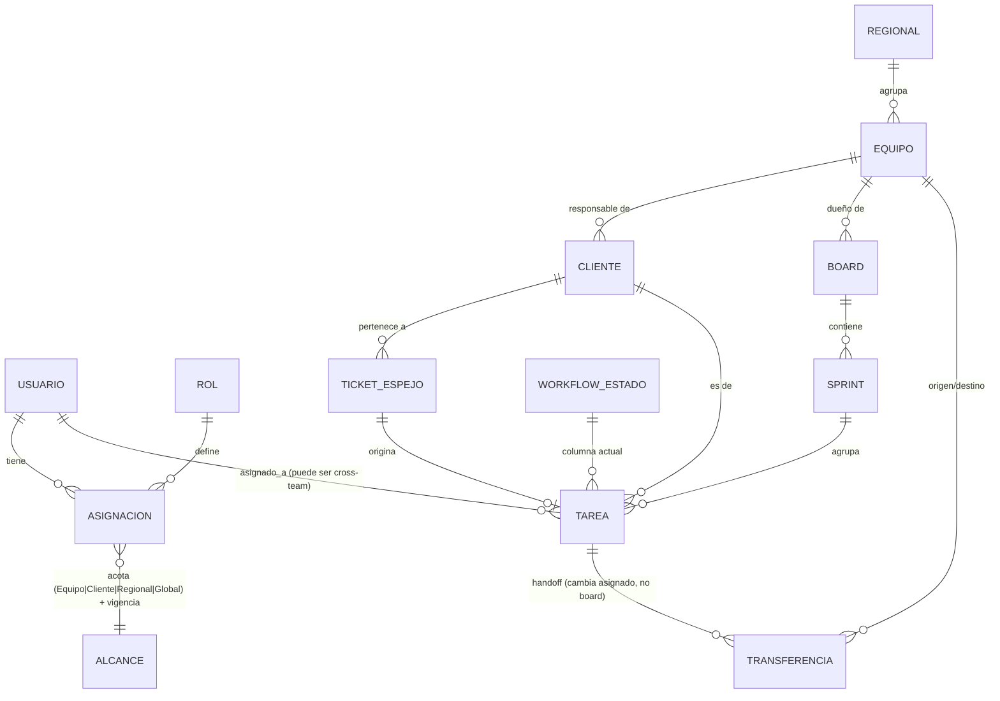

# 01 — Modelo conceptual (validado)

Modelo de dominio para la versión nacional. **Todas las decisiones fueron validadas con el negocio**, no asumidas.

## Los 7 principios rectores (invariantes)

1. **HelpDesk autentica, fitscrum autoriza.** Login/credenciales/nombres viven en el HelpDesk externo (federación de identidad). Rol/permiso/alcance/vigencia viven en fitscrum. Puente: `helpdesk_user_id`. Usuario autenticado sin `Asignacion` vigente → entra pero no ve nada (**default deny**).
2. **El ticket solo trae el mensaje libre del cliente.** No hay campo "aplicación/producto". El enrutamiento a un equipo es **decisión humana asistida**, nunca automática.
3. **La Tarea es la entidad dueña; el ticket es un espejo cacheado** (sync incremental). Una caída del HelpDesk no congela el board.
4. **Una Tarea vive en UN solo board: el del equipo dueño del cliente.** No se duplica, no migra.
5. **El asignado puede ser de otro equipo.** La *Transferencia* (handoff entre despachadores) cambia el asignado, NO el board. El ejecutor de otro equipo trabaja la Tarea vía su filtro personal **"Asignados a mí"** (ya existe en la app actual).
6. **Autorización = Rol (qué hago) × Alcance (sobre qué) × Vigencia (desde/hasta).** Default deny.
7. **Una persona = la suma de sus asignaciones.** La realidad matricial se compone, no se codifica con excepciones.

## Caso de negocio canónico (prueba del modelo)

Un usuario es **Responsable de Equipo** del Equipo Cuenca, que responde por 15 clientes:

```
Asignacion: (USUARIO, rol=RESPONSABLE_EQUIPO, alcance=Equipo{Cuenca}, vigente)
   → OPERA dentro de su equipo (asignar, tableros, sprints) Y
   → VE los tickets de los clientes cuyo equipo responsable es Cuenca,
     aunque los atienda otro equipo (visibilidad derivada de Cliente.equipo_responsable_id).
```

Si un cliente suyo reporta un problema que atiende el Equipo de Quito, el usuario lo VE (es su cliente) pero NO puede resolverlo (no es su equipo ni está asignado). Pide a su **Despachador (HelpDesk) de Cuenca** que **transfiera** al **Despachador de Quito**, quien asigna a un consultor de su equipo. La Tarea sigue en el board de Cuenca (es del cliente de Cuenca), asignada a alguien de Quito, que la trabaja vía "Asignados a mí".

> Nota: el rol **Responsable de Equipo** unifica lo que antes eran dos roles (Líder + Responsable de Cuenta): lidera el equipo **y** responde por los clientes de ese equipo. Una persona aún puede tener **varias asignaciones** (ej. colaboración temporal en otro equipo); aquí basta una.

## Entidades



- **Usuario** — identidad federada (`helpdesk_user_id`).
- **Rol** — qué puede hacer (catálogo abajo).
- **Asignacion** — entidad clave: `(usuario, rol, alcance{tipo, ref}, desde, hasta)`. El alcance es polimórfico: Equipo | Cliente | Regional | Global.
- **Regional** — agrupador geográfico (Cuenca, Quito, Guayaquil…).
- **Equipo** — unidad de trabajo; pertenece a una Regional; dueño de Boards.
- **Cliente** — la COAC (`helpdesk_client_id`). Tiene **`equipo_responsable_id`**: el equipo dueño de la cuenta. De aquí se deriva "los clientes de mi equipo" para la visibilidad del Responsable de Equipo. (Que otro equipo *trabaje* un ticket suyo es emergente vía Transferencia; no cambia el equipo responsable.)
- **TicketEspejo** — **encabezado liviano** del ticket del HelpDesk (`helpdesk_ticket_id`, cliente, asunto, estado_origen, prioridad, fecha_ingreso/modif., asignado_hd, `last_synced_at`). **NO guarda la conversación ni los adjuntos** (mensajes, imágenes, zips): eso se consume **en vivo del HelpDesk** bajo demanda, igual que hoy. La fuente de verdad sigue siendo el HelpDesk; el espejo solo sirve para pintar el board y filtrar por alcance sin pegarle al HelpDesk por cada tarjeta.
- **Tarea** — entidad dueña. `(ticket_espejo, board, sprint, asignado_a, estado_workflow, prioridad, cliente)`.
- **Board** — tablero Scrum de un Equipo. Una Tarea = un Board.
- **Sprint** — pertenece a un Board; cada equipo con su cadencia.
- **WorkflowEstado** — columnas (TO DO, IN PROGRESS, EN CERTIFICACIÓN, ENTREGADO…). Workflow corporativo estándar; extensible.
- **Transferencia** — handoff entre despachadores; cambia `asignado_a`, no el board.

## Roles y permisos

**5 roles** (se eliminó `DESPACHADOR` — 2026-07-06; ver [decisiones.md](../decisiones.md) y
[12-roles-y-responsabilidades.md](12-roles-y-responsabilidades.md)). Los roles se definen **en la
plataforma** (Asignaciones), no por el `role_description` del HelpDesk.

| Acción | CONSULTOR | RESP. DE EQUIPO | ESPECIALISTA | GERENCIA | ADMIN |
|---|---|---|---|---|---|
| Tomar Tarea (autoasignarse) | ✔ | ✔ | ✔ (solo suyas) | — | ✔ |
| Reasignar a otro | — | su equipo | — (solo **solicita**) | — | Global |
| Transferir a otro equipo | — | ✔ | — (solo **solicita**) | — | ✔ |
| Crear Tarea | solo para sí | sus boards | solo para sí | — | ✔ |
| Gestionar Sprint/Board | — | sus boards | — | — | ✔ |
| Ver (visibilidad) | sus Tareas | su equipo + sus clientes (nacional) | sus Tareas | Global (R) | Global |
| Administración | — | — | — | — | ✔ |

> **Especialista (redefinido):** ejecutor **nacional acotado** — solo trabaja/crea lo suyo; para
> reasignar o transferir **envía una solicitud** (con explicación) al **Responsable de Equipo**, que
> decide/ejecuta. `Solicitud(tarea, solicitante, tipo, motivo, estado, resuelta_por)` — implementación diferida.

## Visibilidad (4 planos, derivados de `Asignacion`)

| Plano | Quién | Qué ve | Eje |
|---|---|---|---|
| Operativo | Consultor, Especialista | sus Tareas | usuario |
| Táctico-equipo | Responsable de Equipo | su board | Equipo |
| Táctico-cliente | Responsable de Equipo | los clientes de su equipo (cross-equipo) | Cliente |
| Estratégico | Gerencia, Admin | operación nacional | Global |

Default = **deny**. Todo se deriva de las `Asignacion` vigentes; nada se configura por pantalla.

## Transferencia y Solicitud — IMPLEMENTADAS (2026-07-09)
El "envío de tareas entre equipos" está implementado (ver [decisiones.md](../decisiones.md) 2026-07-09):
- **Transferencia** (equipo→equipo, request-based): el RE/ADMIN del origen la crea; el equipo destino la
  **acepta** (asignando a un miembro) o **rechaza** desde la **Bandeja** (`/bandeja`). Cambia `asignado_a`,
  **NO** el board. Estados `PENDIENTE→COMPLETADA/RECHAZADA` (`transferencia`, V1 + `asignado_destino_id` en V5).
- **Solicitud** (Especialista→RE): el Especialista escala (REASIGNACION|TRANSFERENCIA) sobre una tarea suya;
  el RE aprueba (ejecuta; si es transferencia, genera una `Transferencia`) o rechaza. Tabla `solicitud` (V5).
- Autorización derivada de `Asignacion` (helper `Actor`), actor por header `X-Actor-Hid`.

## Pendientes de definición técnica
- Contrato de la API del HelpDesk: ¿webhooks o solo polling? campos disponibles, paginación, rate limits.
- **Notificaciones** de la Transferencia/Solicitud (hoy la Bandeja es *pull*; falta push/SSE) y qué pasa con
  Tareas "desincronizadas" si el ticket cambia en el HelpDesk.
